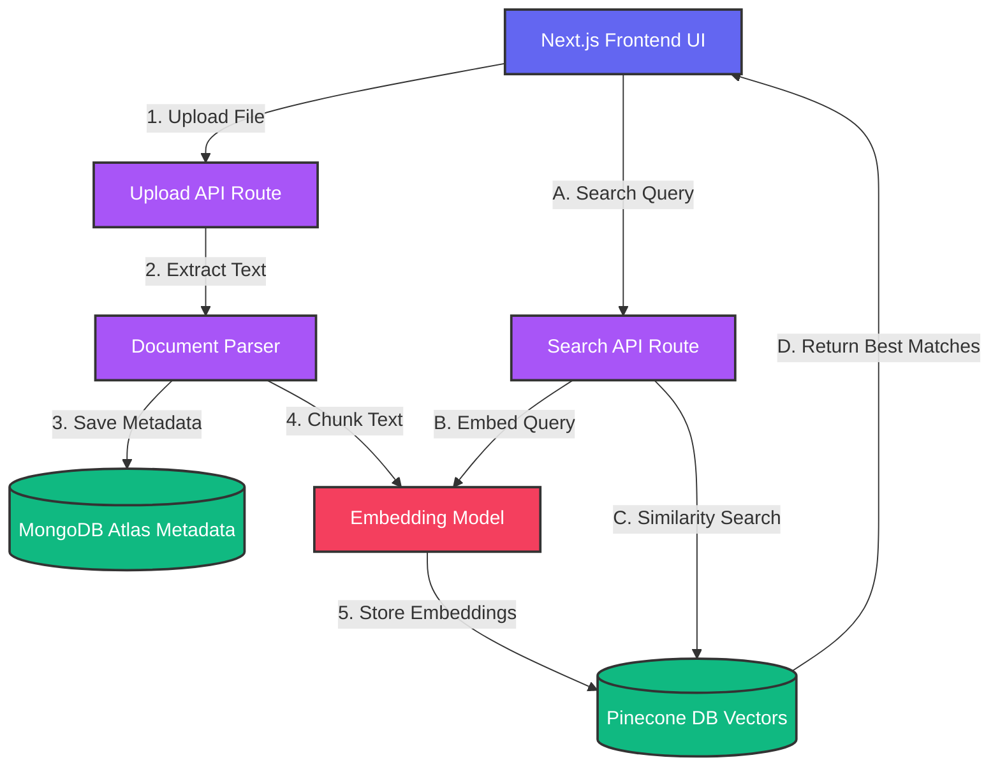

# Aura Search | Personal AI Knowledge Engine

[](https://opensource.org/licenses/MIT)
[](https://nextjs.org/)
[](https://app.netlify.com/start/deploy?repository=https://github.com/tanmaymish/QueryForge)

**🌐 Live Demo:** [https://kaleidoscopic-kringle-c28ec8.netlify.app](https://kaleidoscopic-kringle-c28ec8.netlify.app)

An AI-powered personal knowledge search engine that indexes documents and multimedia files to enable fast semantic search across local data. Built with a unified Next.js architecture using Node.js serverless functions and vector embeddings to deliver intelligent search, metadata filtering, and real-time indexing.

## ✨ Features

- **Semantic Search**: Ask questions in plain English to find relevant passages.
- **Support for PDFs & Docs**: Seamlessly indexes various document types.
- **Glassmorphic UI**: High-end modern design system.
- **Privacy First**: Secure JWT authentication and private vector storage.

## 🏗️ System Architecture



## 🛠️ Tech Stack

- **Frontend/Backend**: Next.js 15+ (App Router, Serverless Functions)
- **Database**: MongoDB Atlas (Metadata)
- **Vector Search**: Pinecone (Serverless)
- **Embeddings**: AI-powered vector generation
- **Styling**: Premium Vanilla CSS

## 🚀 Setup & Installation

### 1. Prerequisites
- [MongoDB Atlas](https://www.mongodb.com/cloud/atlas) account.
- [Pinecone](https://www.pinecone.io/) account (Index dimension: 1536).
- [OpenAI](https://openai.com/) API key (or Hugging Face).

### 2. Configure Environment
Create a `.env.local` file in the root:
```env
MONGODB_URI=your_mongodb_atlas_uri
MONGODB_DB=aura_search
PINECONE_API_KEY=your_pinecone_api_key
PINECONE_INDEX_NAME=aura-search
OPENAI_API_KEY=your_openai_api_key
JWT_SECRET=your_jwt_secret
```

### 3. Run Locally
```bash
npm install
npm run dev
```

## ☁️ Deploying to Netlify

1. Fork this repository.
2. Link to Netlify.
3. Set the **Build Command**: `next build`.
4. Set the **Publish Directory**: `.next`.
5. Add your Environment Variables in the Netlify site settings.

## 📄 License
Distributed under the MIT License. See `LICENSE` for more information.
